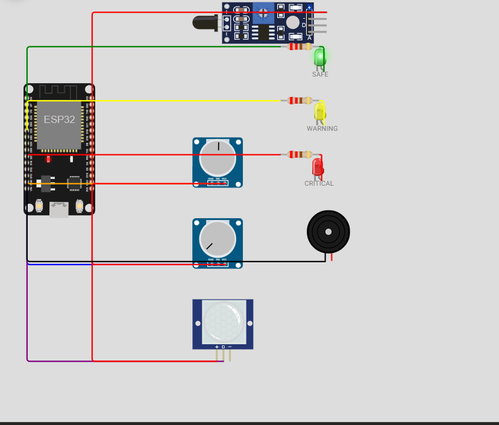
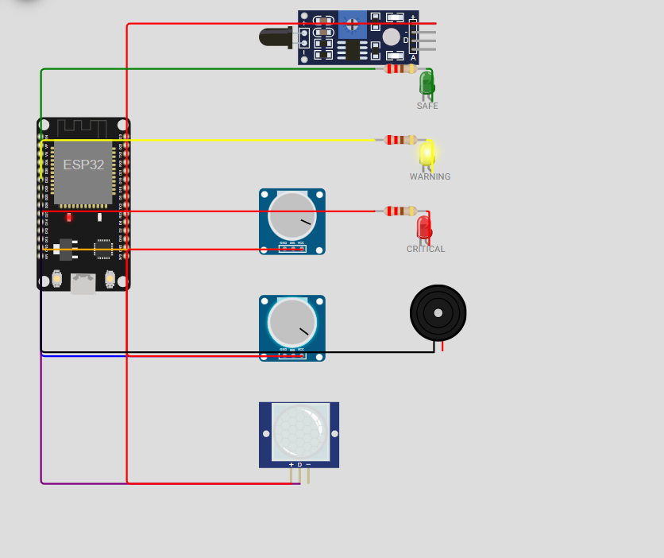
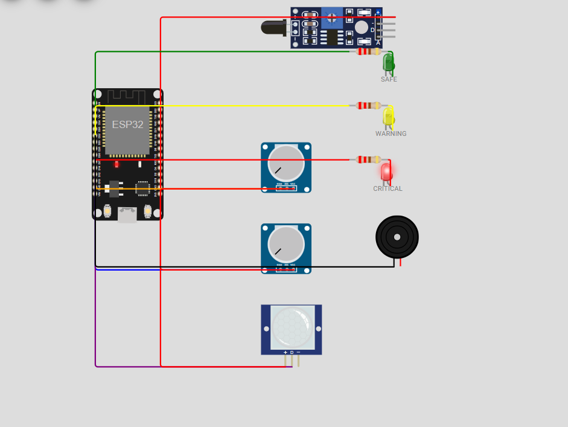

# RoboFusion 1.0 — SCS-RG System Documentation

**Multi-Hazard Smart Campus Safety & Response Grid**

Team: The Underdogs | Track B — Simulation (Wokwi ESP32) | Techathon Round 1, UFTB Robotics Club

---

## 1. Circuit Diagrams (Test Case 26)

Zone 1 — IoT Lab Equivalent (Wokwi ESP32 Simulation)

**SAFE State:**



**WARNING State:**



**CRITICAL State:**



**Pin Configuration:**

| Sensor / Actuator | ESP32 Pin | Type |
|-------------------|-----------|------|
| Flame Sensor | D13 | Digital Input |
| Gas Sensor (MQ-2) | D34 | Analog Input |
| Water Level Sensor | D35 | Analog Input |
| PIR Motion Sensor | D14 | Digital Input |
| Green LED (SAFE) | D25 | Digital Output |
| Yellow LED (WARNING) | D26 | Digital Output |
| Red LED (CRITICAL) | D27 | Digital Output |
| Buzzer | D32 | Digital Output |

**Sensor Behavior:**
- Fire sensor sampled every 500ms; debounce requires 5 consecutive HIGH readings before confirming flame
- Gas sensor readings suppressed for first 30 seconds after boot (warm-up window) — prevents false trigger on power-on noise
- Water level normalized to 0.0–1.0 scale; negative values rejected as invalid input
- PIR retrigger delay prevents log spam on brief exit/re-entry

Zone node sends **raw values only** over serial/HTTP — it never computes or reports its own risk score or state.

---

## 2. Software Architecture (Test Case 27)

```
[Zone Node — Wokwi ESP32]
  Sensors → Debounce / Warmup → Raw values only
        |
        | HTTP POST  {fire, gas, water, occupancy, zone_id}
        v
[Backend — Express / TypeScript  :3000]
  Risk Fusion Engine  →  calculateRiskScore()
  Priority Ranking    →  Zone ordering by risk + occupancy + time
  Alert Broadcast     →  WebSocket + 1.5s polling fallback
  RBAC                →  Role enforcement on every admin endpoint
        |
        | Read / Write
        v
[Database — SQLite via sql.js]
  Zones · Sensors · Readings · Incidents · Acknowledgments · Users · Settings
        |
        | REST API / WebSocket
        v
[Frontend Dashboard — React 19 + Vite  :5173]
  Live Zone Map  →  Priority Queue  →  Incident Timeline
  Role Views     →  ML Risk Panel   →  Actuator Controls
```

**Critical architectural rule:** The zone node sends only raw sensor values. The risk score and SAFE / WARNING / CRITICAL classification are computed exclusively inside the backend's risk fusion engine and persisted to SQLite. The zone node never decides or reports its own state.

---

## 3. API Documentation (Test Case 28)

### GET /api/v1/zones
Returns current state of all zones in a single call.

**Response:**
```json
{
  "success": true,
  "data": [
    {
      "id": "z-1",
      "name": "Chemical Synthesis Lab",
      "code": "CHEM-204",
      "currentState": "CRITICAL",
      "occupantCount": 6,
      "currentRiskScore": {
        "fireScore": 40,
        "gasScore": 28.5,
        "waterScore": 1.6,
        "occupancyScore": 2,
        "totalScore": 68.5,
        "state": "CRITICAL"
      },
      "mlPrediction": {
        "predictedScore30Min": 72,
        "probabilityCritical": 0.91,
        "trendDirection": "rising"
      },
      "actuators": {
        "buzzer": true,
        "strobeLed": true,
        "ventilationRelay": true
      }
    }
  ]
}
```

---

### GET /api/v1/incidents
Returns incident history. Supports filtering by date range.

**Query params:** `?from=2026-07-25&to=2026-07-27`

**Response:**
```json
{
  "success": true,
  "data": [
    {
      "id": "inc-9021",
      "zoneId": "z-1",
      "zoneName": "Chemical Synthesis Lab",
      "startTime": "2026-07-25T18:32:30.843Z",
      "status": "acknowledged",
      "triggerReason": "Gas concentration threshold breached + High PIR Occupancy",
      "maxRiskScore": 68.5,
      "acknowledgedBy": {
        "name": "Sarah Connor",
        "role": "Security Staff"
      },
      "acknowledgedAt": "2026-07-25T21:52:47.562Z"
    }
  ]
}
```

---

### POST /api/v1/incidents/:id/acknowledge
Acknowledges an alert. Race-condition safe — `Acknowledgments.incident_id` has a UNIQUE constraint so only one acknowledgment is ever recorded even if two staff members tap at the same millisecond. Returns **404** if the incident ID does not exist.

**Headers:** `Authorization: Bearer <token>`

**Response (success):**
```json
{ "success": true, "message": "Incident acknowledged" }
```

**Response (already acknowledged):**
```json
{ "success": false, "message": "Incident already acknowledged" }
```

---

### POST /api/v1/sensor-data
Zone node → backend raw readings ingestion endpoint.

**Body:**
```json
{
  "zoneId": "z-1",
  "readings": [
    { "type": "fire", "rawValue": 1 },
    { "type": "gas",  "rawValue": 0.72 },
    { "type": "water","rawValue": 0.1 },
    { "type": "pir",  "rawValue": 1 }
  ]
}
```

Backend computes risk score from these raw values — zone never sends a score or state.

---

### POST /api/v1/config/thresholds — Admin only
Updates SAFE / WARNING / CRITICAL thresholds. Returns **403** if caller role is not Admin. Staff cannot call this even via direct API — role is checked server-side on every request.

---

### GET /api/v1/incidents/critical-last-24h
Demonstrates a real indexed SQL query. Returns all non-resolved CRITICAL incidents from the last 24 hours using the `idx_incidents_status_time` index on `Incidents(status, start_time)`.

---

## 4. Database Schema (Test Case 29)

```
Zones
├── id          TEXT PRIMARY KEY
├── name        TEXT NOT NULL
├── code        TEXT UNIQUE NOT NULL
├── current_state TEXT DEFAULT 'SAFE'
└── occupant_count INTEGER

Sensors
├── id          TEXT PRIMARY KEY
├── zone_id     TEXT → Zones.id
├── type        TEXT  (fire / gas / water / pir)
├── min_value   REAL
└── max_value   REAL

Readings
├── id          INTEGER PRIMARY KEY AUTOINCREMENT
├── zone_id     TEXT → Zones.id  ON DELETE RESTRICT
├── sensor_type TEXT
├── raw_value   REAL
├── normalized_value REAL
└── received_at TEXT DEFAULT (datetime('now'))

Incidents
├── id          TEXT PRIMARY KEY
├── zone_id     TEXT → Zones.id  ON DELETE RESTRICT
├── status      TEXT  (active / acknowledged / resolved)
├── start_time  TEXT
└── end_time    TEXT

Acknowledgments
├── id          INTEGER PRIMARY KEY AUTOINCREMENT
├── incident_id TEXT UNIQUE → Incidents.id   ← UNIQUE prevents double-ack
├── user_id     TEXT
└── ack_time    TEXT DEFAULT (datetime('now'))

Users
├── id          TEXT PRIMARY KEY
├── username    TEXT UNIQUE NOT NULL
└── role        TEXT CHECK(role IN ('Security Staff','Admin'))

Settings
└── key TEXT PRIMARY KEY, value TEXT   ← stores risk weights + thresholds as JSON
```

**Key constraints:**
- `Readings.zone_id` → `Zones.id` ON DELETE RESTRICT — cannot delete a zone that has readings
- `Incidents.zone_id` → `Zones.id` ON DELETE RESTRICT — cannot delete a zone with open incidents
- `Acknowledgments.incident_id` UNIQUE — race-condition safety, only one ack wins
- `INDEX idx_incidents_status_time ON Incidents(status, start_time)` — fast 24h CRITICAL query

---

## 5. Risk Fusion Formula (Test Case 30)

```
risk_score = (0.4 × fire) + (0.3 × gas_norm) + (0.2 × water_norm) + (0.1 × occupancy)

SAFE:     score < 30
WARNING:  30 ≤ score < 60
CRITICAL: score ≥ 60
```

*(Matches actual DEFAULT_THRESHOLDS in riskCalculator.ts: safeUpperLimit=30, warningUpperLimit=60)*

**Weight Justification:**

- **Fire (0.4):** Highest weight — fire escalates fastest and causes the most immediate damage in a lab environment full of electronics and chemicals.
- **Gas (0.3):** Second highest — toxic or flammable gas accumulation is an immediate life threat and can precede an explosion.
- **Water (0.2):** Electrical short-circuit risk and expensive equipment damage; lower than fire/gas because it typically escalates more slowly.
- **Occupancy (0.1):** Lowest per-zone weight because an empty zone with a real fire is still dangerous to equipment and responders. However, occupancy weighs heavily in the **cross-zone priority ranking** — a CRITICAL occupied zone is always ranked above a CRITICAL empty zone at the same risk score.

All weights sum to 1.0, so risk_score naturally falls in the range 0–100.

---

## 6. Backup & Recovery Strategy (Test Case 20)

**Backup approach:**
- SQLite database (`robofusion.db`) is exported via `sql.js`'s `.export()` buffer on a scheduled interval (every 30 minutes in development, daily in production)
- Backup written to `robofusion_backup_YYYYMMDD.db` in a separate directory

**Recovery path:**
- Stop backend
- Copy backup file to `robofusion.db`
- Restart backend — `initDB()` loads existing file on startup, all zone/incident/user state reconstructed directly from database
- Only data written between last backup and failure is lost (bounded by backup interval)

---

## 7. Data Retention & Access Policy (Test Case 21)

- Raw `Readings` older than **90 days** are summarized and dropped to keep the database lean
- `Incidents` (the audit trail) are kept indefinitely — they are small records and legally important
- **Admin** role: can query raw historical readings directly via API
- **Security Staff** role: sees current zone status and the incident timeline only — cannot access raw sensor reading history

---

## 8. Scalability for 30+ Zones (Test Case 11b)

**Current setup:** 5 zones, single Express process, SQLite via sql.js (in-memory + file-backed)

**To scale to 30+ zones:**
- Migrate database to **PostgreSQL** for real concurrent write throughput and proper connection pooling
- Add **Redis** for cross-instance WebSocket pub/sub (so multiple backend workers share the same broadcast channel)
- Run backend behind a **load balancer** with multiple worker processes (e.g. PM2 cluster mode)
- Move ML prediction to a separate microservice so it does not block the ingestion path

---

## 9. ML Risk Prediction (Bonus 3)

- Trained on synthetic sensor history generated from the risk fusion formula
- Model type: logistic regression over a short rolling window of normalized sensor readings
- Outputs `probabilityCritical` (0.0–1.0) and `trendDirection` (rising / falling / stable)
- Displayed as a **separate "Predicted Risk" panel** on the dashboard — clearly labelled, never mixed with the live risk score
- **Safety statement:** The predicted value can never, by itself, trigger the relay, buzzer, or any actuator. All actuation is gated exclusively on the live server-side risk score crossing the CRITICAL threshold.
